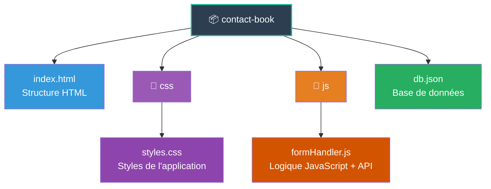

# 📒 Contact Book - Application de Gestion de Contacts

Application web vanilla JavaScript pour gérer un carnet de contacts avec persistance des données via **json-server**.

## 📁 Structure du Projet



## 📄 Fichiers

### **index.html**
Structure HTML contenant :
- En-tête avec titre et bouton d'ajout (+)
- Tableau d'affichage des contacts
- Modal (fenêtre popup) pour l'ajout de contacts
- Formulaire avec 4 champs : Nom, Prénom, Email, Téléphone

### **css/styles.css**
Feuille de styles avec :
- Design dark mode (fond noir)
- Styles pour le tableau et la modal
- États des boutons (hover, disabled)
- Animation et responsive design

### **js/formHandler.js**
Logique JavaScript avec approche fonctionnelle et gestion API

#### 🔧 **Fonctions principales**

| Fonction | Description |
|----------|-------------|
| **API** | |
| `fetchContacts()` | Récupère tous les contacts depuis json-server (GET) |
| `postContact(contactData)` | Ajoute un contact sur le serveur (POST) |
| **Utilitaires** | |
| `getFormData()` | Récupère les valeurs des champs du formulaire |
| `clearForm()` | Réinitialise le formulaire à son état initial |
| `renderContact(contact)` | Génère le HTML d'une ligne de tableau |
| `renderContacts(contacts)` | Affiche tous les contacts dans le tableau |
| **Modal** | |
| `openModal()` | Ouvre la fenêtre d'ajout de contact |
| `closeModal()` | Ferme la fenêtre d'ajout de contact |
| **Événements** | |
| `handleSubmit(e)` | Gère la soumission du formulaire et l'ajout au serveur |

### **db.json**
Base de données JSON utilisée par json-server :
```json
{
  "contacts": [
    {
      "id": 1,
      "nom": "Aubert",
      "prenom": "Jean-Luc",
      "email": "jean-luc.aubert@aelion.fr",
      "telephone": "0123456789"
    }
  ]
}
```

## ✨ Fonctionnalités

- ✅ **Chargement automatique** des contacts au démarrage
- ✅ **Ajout de contacts** via modal avec persistance
- ✅ **Validation en temps réel** (bouton grisé si formulaire invalide)
- ✅ **Validation HTML5** (required, type="email", etc.)
- ✅ **Gestion des erreurs** avec messages d'alerte
- ✅ **Indicateur de chargement** lors de l'envoi
- ✅ **Contact par défaut** (Jean-Luc Aubert)
- ✅ **Design responsive** et moderne

## 🚀 Installation

### Prérequis
- Node.js et npm installés

### Étapes

1. **Cloner ou télécharger le projet**
   ```bash
   git clone <votre-repo>
   cd contact-book
   ```

2. **Installer json-server**
   ```bash
   npm install -g json-server
   ```

3. **Vérifier la structure des dossiers**
   ```
   contact-book/
   ├── index.html
   ├── db.json
   ├── css/
   │   └── styles.css
   └── js/
       └── formHandler.js
   ```

4. **Lancer json-server**
   ```bash
   json-server --watch db.json --port 3000
   ```
   
   Le serveur API sera accessible sur `http://localhost:3000`

5. **Ouvrir l'application**
   - Ouvrir `index.html` dans un navigateur
   - **Important** : Utiliser un serveur local (Live Server, http-server, etc.) pour éviter les erreurs CORS

   Exemple avec Live Server (VS Code) :
   ```bash
   # Installer l'extension Live Server dans VS Code
   # Puis clic droit sur index.html > "Open with Live Server"
   ```

## 🌐 API Endpoints

L'application utilise json-server qui expose automatiquement une API REST :

| Méthode | Endpoint | Description |
|---------|----------|-------------|
| `GET` | `/contacts` | Récupère tous les contacts |
| `GET` | `/contacts/:id` | Récupère un contact par ID |
| `POST` | `/contacts` | Crée un nouveau contact |
| `PUT` | `/contacts/:id` | Modifie un contact |
| `DELETE` | `/contacts/:id` | Supprime un contact |

**URL de base** : `http://localhost:3000`

## 🎯 Approche Technique

### Architecture
- **Paradigme** : Programmation fonctionnelle
- **État** : Centralisé et immutable
- **API** : REST avec json-server
- **Requêtes** : Fetch API avec async/await
- **Gestion d'erreurs** : try/catch avec feedback utilisateur

### Technologies
- **Frontend** : HTML5, CSS3, JavaScript ES6+
- **Backend** : json-server (serveur API REST)
- **Validation** : HTML5 (required, type) + checkValidity()
- **Persistance** : Fichier JSON (db.json)

### Principes appliqués
- Fonctions pures (pas d'effets de bord)
- Immutabilité (spread operator pour les mises à jour)
- Séparation des responsabilités (API / UI / Logic)
- Gestion asynchrone (async/await)
- Expérience utilisateur (loading states, error handling)

## 🐛 Dépannage

### "Impossible de charger les contacts"
- Vérifier que json-server est bien lancé sur le port 3000
- Vérifier que `db.json` existe à la racine du projet

### Erreurs CORS
- Utiliser un serveur local (Live Server, http-server)
- Ne pas ouvrir le fichier HTML directement (file://)

### Le bouton "Valider" reste grisé
- Vérifier que tous les champs sont remplis
- Vérifier que l'email a un format valide

## 📝 TODO / Améliorations futures

- [ ] Fonction de modification de contact
- [ ] Fonction de suppression de contact
- [ ] Recherche/filtrage des contacts
- [ ] Tri par colonne
- [ ] Pagination
- [ ] Export CSV
- [ ] Mode clair/sombre

---

**© 2025 - Acme Corp.**

Développé avec ❤️ en JavaScript Vanilla