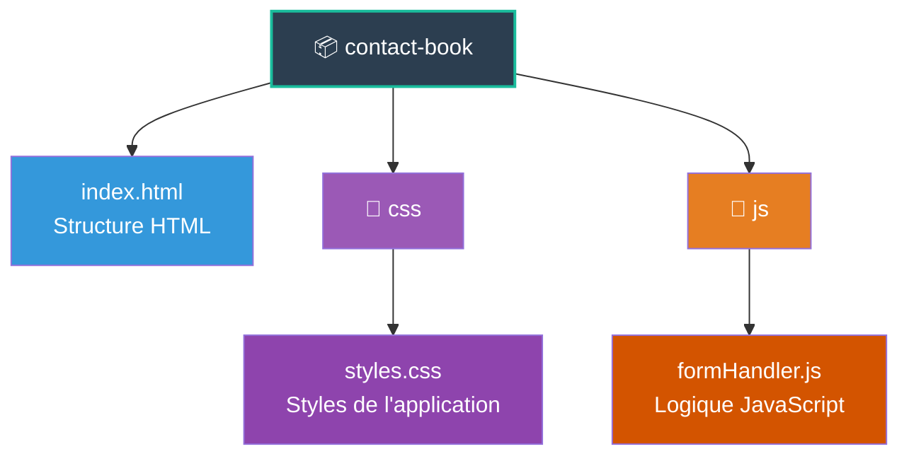

# 📒 Contact Book - Application de Gestion de Contacts

Application web vanilla JavaScript pour gérer un carnet de contacts avec une approche fonctionnelle.

## 📁 Structure du Projet

## 📄 Fichiers

### **index.html**
Structure HTML contenant :
- En-tête avec titre et bouton d'ajout (+)
- Tableau d'affichage des contacts
- Modal (fenêtre popup) pour l'ajout de contacts
- Formulaire avec 4 champs : Nom, Prénom, Email, Téléphone

### **css/styles.css**
Feuille de styles avec :
- Design dark mode (fond noir)
- Styles pour le tableau et la modal
- États des boutons (hover, disabled)
- Animation du tooltip d'erreur

### **js/formHandler.js**
Logique JavaScript avec approche fonctionnelle

#### 🔧 **Fonctions principales**

| Fonction | Description |
|----------|-------------|
| `createContact(formData)` | Crée un nouveau contact avec ID unique |
| `addContact(contacts, newContact)` | Ajoute un contact à la liste (immutable) |
| `validateForm(formData)` | Valide les champs du formulaire |
| `getFormData()` | Récupère les valeurs des champs |
| `renderContact(contact)` | Génère le HTML d'une ligne de tableau |
| `renderContacts(contacts)` | Affiche tous les contacts dans le tableau |
| `clearForm()` | Réinitialise le formulaire |
| `showErrors(errors)` | Affiche visuellement les erreurs |
| `showTooltip(element, message)` | Affiche un message temporaire |
| `openModal()` | Ouvre la fenêtre d'ajout |
| `closeModal()` | Ferme la fenêtre d'ajout |
| `handleSubmit(e)` | Gère l'ajout d'un nouveau contact |

## ✨ Fonctionnalités

- ✅ Ajout de contacts via modal
- ✅ Validation en temps réel (bouton grisé si formulaire invalide)
- ✅ Affichage d'erreurs sur les champs vides
- ✅ Tooltip informatif en cas d'erreur
- ✅ Contact par défaut (Jean-Luc Aubert)
- ✅ Design responsive et moderne

## 🚀 Installation

1. Télécharger les 3 fichiers
2. Respecter la structure de dossiers
3. Ouvrir `index.html` dans un navigateur

## 🎯 Approche Technique

- **Paradigme** : Programmation fonctionnelle
- **État** : Centralisé et immutable
- **Fonctions** : Pures (pas d'effets de bord)
- **Validation** : HTML5 + JavaScript personnalisé

---

**© 2025 - Acme Corp.**
